# Protected Azure Container - Architecture Plan

## Goal

Build a world-class protected container setup extracted, featuring:
- **VS Code-based Web UI** as the main interface
- **Two containers**: app container + Caddy TLS sidecar
- **Azure Key Vault** for secrets management
- **Azure Files** for state persistence
- **Azure Managed Identity** for authentication between Azure resources
- **GitHub Actions** for CI/CD with OIDC authentication

---

## Architecture Overview

```mermaid
graph TB
    subgraph "Azure Container Instances"
        subgraph "Container Group"
            Caddy["Caddy TLS Proxy<br/>:80, :443"]
            App["code-server Container<br/>:8080"]
        end
    end
    
    Internet["Internet"] --> Caddy
    Caddy -->|"/* → code-server"| App
    
    subgraph "Azure Services"
        KV["Key Vault<br/>(secrets)"]
        Files["Azure Files<br/>(workspace, config)"]
        MI["Managed Identity"]
    end
    
    App --> KV
    App --> Files
    MI --> KV
```



---

## User Review Required

> [!IMPORTANT]
> **VS Code Web UI Decision**: Should we use:
> 1. **code-server** (Coder's VS Code in browser) - Full VS Code experience
>
> Recommendation: **code-server** for maximum familiarity and extension support. The container will not have any other application running.

---

## Proposed Changes

### Phase 1: Core Container Structure

---

#### [MODIFY] [Dockerfile](file:///home/ronny/dev/protected-container/docker/Dockerfile)

Replace Chrome/noVNC setup with code-server:

```diff
- # Install Google Chrome
- RUN wget -q -O - https://dl-ssl.google.com/linux/linux_signing_key.pub | ...
+ # Install code-server (VS Code in browser)
+ RUN curl -fsSL https://code-server.dev/install.sh | sh
```

We no longer use VNC.
Update supervisord if still needed to run code-server.

---

#### [MODIFY] [docker-compose.yml](file:///home/ronny/dev/protected-container/docker-compose.yml)

Add Caddy sidecar service and update networking:
CODE_SERVER_PASSWORD will be fetched from Key Vault in production, from .env in development. Keyvault will have an env secret which is downloaded and store in the .env file.
AZURE_KEYVAULT_URI needs to be set while building the container.
BASIC_AUTH_USER and BASIC_AUTH_HASH will be fetched from Key Vault in production.
PUBLIC_DOMAIN and ACME_EMAIL are only used during deployment and is stored in .env.deploy.

```yaml
services:
  app:
    build: .
    container_name: protected-container
    environment:
      # code-server config
      CODE_SERVER_PORT: 8080
      PASSWORD: ${CODE_SERVER_PASSWORD:-}
      # Key Vault integration
      AZURE_KEYVAULT_URI: ${AZURE_KEYVAULT_URI}
    volumes:
      - ./workspace:/home/coder/workspace
      - state:/app/.state
      - logs:/app/logs
    expose:
      - "8080"  # code-server

  caddy:
    image: caddy:2-alpine
    container_name: tls-proxy
    restart: unless-stopped
    ports:
      - "80:80"
      - "443:443"
    environment:
      PUBLIC_DOMAIN: ${PUBLIC_DOMAIN}
      ACME_EMAIL: ${ACME_EMAIL}
      BASIC_AUTH_USER: ${BASIC_AUTH_USER}
      BASIC_AUTH_HASH: ${BASIC_AUTH_HASH}
    volumes:
      - ./caddy/Caddyfile:/etc/caddy/Caddyfile:ro
      - caddy_data:/data
      - caddy_config:/config
    depends_on:
      - app

volumes:
  state:
  logs:
  caddy_data:
  caddy_config:
```

---

#### [NEW] [docker/Caddyfile](file:///home/ronny/dev/protected-container/docker/Caddyfile)

> **Answer: Move to docker/** - Yes, for consistency with `supervisord.conf`.
>
> **Answer: Single auth** - Yes! We run code-server with `--auth none` and rely entirely on Caddy's Basic Auth. All traffic goes through Caddy, so this is secure and avoids double-login.

TLS configuration with automatic cert management:

```caddyfile
{$PUBLIC_DOMAIN} {
    tls {$ACME_EMAIL}
    
    # Single Basic Auth layer - code-server runs with --auth none
    basicauth /* {
        {$BASIC_AUTH_USER} {$BASIC_AUTH_HASH}
    }
    
    reverse_proxy app:8080
}
```

---

### Phase 2: Azure Integration

---
There is only one main deployment script which is scripts/deploy/azure_deploy_container.py. With this one single script we can deploy the container and the caddy sidecar.

#### [MODIFY] [scripts/azure_start.py](file:///home/ronny/dev/protected-container/scripts/azure_start.py)

Update entrypoint to:
1. Fetch secrets from Key Vault
2. Configure code-server
3. Start supervisord

---

#### [MODIFY] scripts/deploy/azure_deploy_container.py

Update ACI deployment to:
- Add Caddy as sidecar container
- Configure correct port mappings (80, 443)
- Mount shared volumes between containers

---

#### [MODIFY] [docker/supervisord.conf](file:///home/ronny/dev/protected-container/docker/supervisord.conf)

Run code-server with `--auth none` (Caddy handles auth):

```ini
[supervisord]
nodaemon=true
logfile=/var/log/supervisor/supervisord.log

[program:code-server]
command=code-server --bind-addr 0.0.0.0:8080 --auth none /home/coder/workspace
autorestart=true
stdout_logfile=/dev/stdout
stdout_logfile_maxbytes=0
stderr_logfile=/dev/stderr
stderr_logfile_maxbytes=0
```

---

### Phase 3: Documentation

---

#### [MODIFY] [docs/AZURE_CONTAINER.md](file:///home/ronny/dev/protected-container/docs/AZURE_CONTAINER.md)

Update documentation for:
- New VS Code-based architecture
- Changed environment variables
- Updated deployment steps

---

#### [MODIFY] [README.md](file:///home/ronny/dev/protected-container/README.md)

Update to reflect new purpose and quickstart.


Add docs/CODE_SERVER.md to explain the code-server setup. All docs are reference in the README.md.
---

## Verification Plan

### Automated Tests

1. **Docker Build Test**
   ```bash
   docker compose build
   ```
   Verify: Exit code 0, no build errors

2. **Container Start Test**
   ```bash
   docker compose up -d
   docker compose ps
   ```
   Verify: Both `app` and `caddy` containers running

   > **Answer: run.py** - No longer needed. The container runs code-server directly via supervisord. We can delete `run.py`, `src/`, and Python app code - this repo becomes purely infrastructure.

3. **Health Check**
   ```bash
   curl -k https://localhost/healthz
   ```
   Verify: Returns 200 OK
tests/pytests will have to be updated. Use in ci.yml
### Manual Verification

1. **Local Development**
   - Run `docker compose up`
   - Open `https://localhost` in browser
   - Verify Basic Auth prompt appears
   - Verify VS Code interface loads after authentication

2. **Azure Deployment**
  - Deploy using `scripts/deploy/azure_deploy_container.py`
   - Access `https://<your-domain>/`
   - Verify TLS certificate is valid (Let's Encrypt)
   - Verify Key Vault secrets are loaded

---

## Pre-installed Extensions

We'll pre-install these extensions in the Dockerfile:

```dockerfile
# Install extensions
RUN code-server --install-extension rooveterinaryinc.roo-cline \
    && code-server --install-extension GitHub.vscode-pull-request-github
```

| Extension | ID | Purpose |
|-----------|----|---------|
| Roo Code | `rooveterinaryinc.roo-cline` | AI coding assistant |
| GitHub Pull Requests | `GitHub.vscode-pull-request-github` | PR management |

---

## Resolved Decisions

| Question | Answer |
|----------|--------|
| VS Code variant | **code-server** (Coder) |
| Auth | **Single auth via Caddy** (code-server uses `--auth none`) |
| Caddyfile location | **docker/Caddyfile** |
| run.py needed? | **No** - pure infrastructure repo |
| Domain | **Configured in .env.deploy** |
